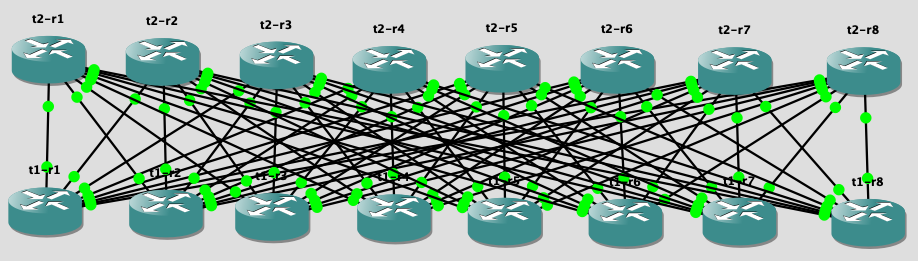

<p align="center">
  <a href="https://github.com/ervbrian/ClosBuilder">
    
  </a>

  <h3 align="center">ClosBuilder</h3>

  <p align="center">
    A tool suite for generating and deploying network configurations for Clos architectures.
    <br />
    <a href="https://github.com/ervbrian/ClosBuilder/blob/master/README.md"><strong>Explore the docs »</strong></a>
    <br />
  </p>
</p>


<!-- TABLE OF CONTENTS -->
<details open="open">
  <summary>Table of Contents</summary>
  <ol>
    <li>
      <a href="#about-the-project">About The Project</a>
      <ul>
        <li><a href="#built-with">Built With</a></li>
      </ul>
    </li>
    <li>
      <a href="#getting-started">Getting Started</a>
      <ul>
        <li><a href="#prerequisites">Prerequisites</a></li>
        <li><a href="#installation">Installation</a></li>
      </ul>
    </li>
    <li><a href="#usage">Usage</a></li>
    <li><a href="#contributing">Contributing</a></li>
    <li><a href="#license">License</a></li>
    <li><a href="#contact">Contact</a></li>
  </ol>
</details>


<!-- ABOUT THE PROJECT -->
## About The Project

Clos architectures require significantly more devices and interconnections compared to traditional network designs. Configuration management and deployment can be very tedious if automation is not utilized. 

This tool-suite helps to solve the following:
* Generate standarized configurations for Clos architectures in GNS3 simulations
* Deployment of router configurations to Docker containers running FRR (Free Range Routing) within GNS3 simulations

### Built With

* [Python](https://www.python.org/)
* [Jinja](https://jinja.palletsprojects.com/en/3.0.x/)


<!-- GETTING STARTED -->
## Getting Started

### Prerequisites

GNS3 is required to create a network simulation and establish connectivity between router instances
* [GNS3 Getting Started Guide](https://docs.gns3.com/docs/)

An FRR Docker container template must be configured in GNS3 to enable topology creation
* [Container Creation Guide](https://docs.gns3.com/docs/emulators/create-a-docker-container-for-gns3/)
* [Free Range Routing](http://docs.frrouting.org/projects/dev-guide/en/latest/building-docker.html)

### Installation

1. Clone the repo
   ```sh
   $ git clone https://github.com/ervbrian/ClosBuilder.git
   ```
2. Create Virtual Environment
   ```sh
   cd ClosBuilder
   $ python3 -m venv venv
   ```
3. Activate Virtual Environment
   ```sh
   $ source venv/bin/activate
   ```
4. Install Python Requirements
   ```sh
   $ python3 -m pip install -r requirements.txt
   ```

<!-- USAGE EXAMPLES -->
## Usage

### Configuration Generation

#### Create Input YAML
Example for an 8-wide topology with client networks connecting to two of the T1 routers:
```yaml
architecture: "TwoTierClos"           # Used to determine which modeling class is used
width: 8                              # How many devices per tier/layer
internal_supernet: "10.0.0.0/25"      # Used for PtP IP address allocation between Clos tiers
loopback_supernet: "10.255.255.0/28"  # Used for loopback address allocation
external_networks: {                  # Used to add BGP network statements to advertise networks 
  "192.168.1.0/24": ["t1-r1"],        # external to the Clos architecture
  "192.168.2.0/24": ["t1-r4"],
}
```

#### Generate Configurations
```
$ python generate_configurations.py -h
usage: generate_configurations.py [-h] -i INPUT_FILE [-g] [-o OUTPUT_DIR]

optional arguments:
  -h, --help            show this help message and exit
  -i INPUT_FILE, --input_file INPUT_FILE
                        Input YAML containing network implementation details
  -g, --generate        Generate device configurations after modeling netwwork architecture
  -o OUTPUT_DIR, --output_dir OUTPUT_DIR
                        Absolute path to directory where configurations will be written
```

#### Example Execution
```sh
$ python generate_configurations.py -i examples/TwoTierClos_8w.yaml -g -o /tmp/output

#### Architecture Stats ####
Clos Width: 8
Total Internal Connections: 64
Total Unused Internal Subnets: 0
Total Unused Loopbacks: 0
Total CLient Facing Ports: 64

Writing configurations to /tmp/output/t1-r1_zebra.conf
Writing configurations to /tmp/output/t1-r1_ospfd.conf
Writing configurations to /tmp/output/t1-r1_bgpd.conf
...
```

### Configuration Deployment

#### Create GNS3 Topology
Once configurations are generated and an FRR container template has been created in GNS3, you'll have to manually create a network topology in GNS3 and interconnect the devices.

Here is an example of a 8-wide 2-tier topology:<br>


Once created, the project's JSON file can be referenced to deploy configurations directly to Docker containers.

#### Configure GNS3 VM's Docker service to accept remote connections

##### Update the following configuration:
```sh
$ nano /lib/systemd/system/docker.service

# Update the following line to add TCP listener
ExecStart=/usr/bin/dockerd -H fd:// --containerd=/run/containerd/containerd.sock -H=tcp://0.0.0.0:2375
```

##### Restart Docker
```sh
systemctl daemon-reload
sudo service docker restart
```

#### Deploy Configurations
```
$ python deploy_gns.py -h             
usage: deploy_gns.py [-h] -i INPUT_JSON -dc DOCKER_CLIENT -c CONFIG_DIR [-s] [-init] [-ch CHECK_COMMANDS [CHECK_COMMANDS ...]]

optional arguments:
  -h, --help            show this help message and exit
  -i INPUT_JSON, --input_json INPUT_JSON
                        Input JSON containing GNS3 topology details
  -dc DOCKER_CLIENT, --docker_client DOCKER_CLIENT
                        Docker client URL (Eg. tcp://10.0.0.3:2375)
  -c CONFIG_DIR, --config_dir CONFIG_DIR
                        Absolute path to directory containing network device configurations
  -s, --shift_traffic   Shift traffic away from devices before pushing configuration
  -init, --initial_push
                        Use when device is brand new to the network
  -ch CHECK_COMMANDS [CHECK_COMMANDS ...], --check_commands CHECK_COMMANDS [CHECK_COMMANDS ...]
                        List of validation commands to execute after configuration push
```

#### Example Execution
```sh
$ python deploy_gns.py -i /Users/brianervin/GNS3/projects/QuaggaSandbox/QuaggaSandbox.gns3 -dc=tcp://10.0.0.3:2375 -c=/tmp/output -ch "vtysh -c 'show ip ospf neigh'" "vtysh -c 'show ip bgp sum'"
Verifying connection to Docker containers for all network devices
Connection verification for t2-r2 SUCCEEDED
Connection verification for t2-r3 SUCCEEDED
Connection verification for t2-r4 SUCCEEDED
Connection verification for t1-r2 SUCCEEDED
Connection verification for t1-r3 SUCCEEDED
Connection verification for t1-r1 SUCCEEDED
Connection verification for t1-r4 SUCCEEDED
Connection verification for t2-r1 SUCCEEDED
Connection verification for t2-r5 SUCCEEDED
Connection verification for t2-r6 SUCCEEDED
Connection verification for t2-r7 SUCCEEDED
Connection verification for t2-r8 SUCCEEDED
Connection verification for t1-r5 SUCCEEDED
Connection verification for t1-r6 SUCCEEDED
Connection verification for t1-r7 SUCCEEDED
Connection verification for t1-r8 SUCCEEDED
## Starting deployment to 16 devices ## 

Backing up frr.conf on t2-r2 as frr.conf.backup
Staging frr.conf on t2-r2
Restarting FRR service on t2-r2
Running the following check as per deployment options:
vtysh -c 'show ip ospf neigh'

Neighbor ID     Pri State           Dead Time Address         Interface            RXmtL RqstL DBsmL
10.255.255.0      1 Full/DROther       3.333s 10.0.0.17       eth0:10.0.0.16           0     0     0
10.255.255.1      1 Full/DROther       3.038s 10.0.0.19       eth1:10.0.0.18           0     0     0
10.255.255.2      1 Full/DROther       3.723s 10.0.0.21       eth2:10.0.0.20           0     0     0
10.255.255.3      1 Full/DROther       3.190s 10.0.0.23       eth3:10.0.0.22           0     0     0
10.255.255.4      1 Full/DROther       3.424s 10.0.0.25       eth4:10.0.0.24           0     0     0
10.255.255.5      1 Full/DROther       3.009s 10.0.0.27       eth5:10.0.0.26           0     0     0
10.255.255.6      1 Full/DROther       3.724s 10.0.0.29       eth6:10.0.0.28           0     0     0
10.255.255.7      1 Full/DROther       3.644s 10.0.0.31       eth7:10.0.0.30           0     0     0


Running the following check as per deployment options:
vtysh -c 'show ip bgp sum'

IPv4 Unicast Summary:
BGP router identifier 10.255.255.9, local AS number 65000 vrf-id 0
BGP table version 2
RIB entries 3, using 480 bytes of memory
Peers 8, using 165 KiB of memory
Peer groups 1, using 64 bytes of memory

Neighbor        V         AS MsgRcvd MsgSent   TblVer  InQ OutQ  Up/Down State/PfxRcd
10.255.255.0    4      65000       4       6        0    0    0 00:00:03            1
10.255.255.1    4      65000       3       7        0    0    0 00:00:03            0
10.255.255.2    4      65000       3       7        0    0    0 00:00:03            0
10.255.255.3    4      65000       4       6        0    0    0 00:00:03            1
10.255.255.4    4      65000       3       6        0    0    0 00:00:03            0
10.255.255.5    4      65000       3       5        0    0    0 00:00:03            0
10.255.255.6    4      65000       3       6        0    0    0 00:00:03            0
10.255.255.7    4      65000       3       6        0    0    0 00:00:03            0

Total number of neighbors 8

Deployment to t2-r2 completed successfully

...
# Iterate through all other devices
```

<!-- CONTRIBUTING -->
## Contributing

Contributions are what make the open source community such an amazing place to be learn, inspire, and create. Any contributions you make are **greatly appreciated**.

1. Fork the Project
2. Create your Feature Branch (`git checkout -b feature/AmazingFeature`)
3. Commit your Changes (`git commit -m 'Add some AmazingFeature'`)
4. Push to the Branch (`git push origin feature/AmazingFeature`)
5. Open a Pull Request

<!-- LICENSE -->
## License

Distributed under the MIT License. See `LICENSE` for more information.

<!-- CONTACT -->
## Contact

Brian Ervin - brian.s.ervin@gmail.com

Project Link: [https://github.com/ervbrian/ClosBuilder](https://github.com/ervbrian/ClosBuilder)
